# 第 6 章　11 层中间件管道：Agent 的神经系统

如果 Lead Agent 是大脑，那么中间件管道就是它的神经系统。DeerFlow 通过最多 11 层中间件处理所有 Cross-cutting Concerns——从沙箱环境初始化到对话摘要，从悬空工具调用修复到澄清请求拦截。本章逐一拆解每一层中间件的源码与设计意图。

## 6.1 为什么需要中间件

Agent 的核心逻辑是"接收消息 -> 调用模型 -> 执行工具 -> 返回结果"。但在这个主循环之外，有大量的横切关注点（Cross-cutting Concerns）需要处理：

- 每次对话需要创建沙箱目录
- 用户上传的文件需要注入到消息上下文
- 对话过长时需要自动摘要
- 模型可能生成悬空的工具调用
- 首次对话后需要自动生成标题

如果把这些逻辑全部写在主循环中，代码会迅速膨胀且难以维护。中间件模式将这些关注点解耦为独立的、可组合的层，每一层只关心自己的职责。

## 6.2 中间件链的构建

`_build_middlewares` 函数负责根据运行时配置动态组装中间件链：

```python
def _build_middlewares(config: RunnableConfig, model_name: str | None,
                       agent_name: str | None = None):
    middlewares = [
        ThreadDataMiddleware(),
        UploadsMiddleware(),
        SandboxMiddleware(),
        DanglingToolCallMiddleware(),
    ]

    # 可选：Summarization
    summarization_middleware = _create_summarization_middleware()
    if summarization_middleware is not None:
        middlewares.append(summarization_middleware)

    # 可选：TodoList（仅 Plan Mode）
    is_plan_mode = config.get("configurable", {}).get("is_plan_mode", False)
    todo_list_middleware = _create_todo_list_middleware(is_plan_mode)
    if todo_list_middleware is not None:
        middlewares.append(todo_list_middleware)

    middlewares.append(TitleMiddleware())
    middlewares.append(MemoryMiddleware(agent_name=agent_name))

    # 可选：ViewImage（仅视觉模型）
    model_config = app_config.get_model_config(model_name)
    if model_config is not None and model_config.supports_vision:
        middlewares.append(ViewImageMiddleware())

    # 可选：SubagentLimit（仅 Subagent 模式）
    if subagent_enabled:
        middlewares.append(SubagentLimitMiddleware(max_concurrent=max_concurrent_subagents))

    # ClarificationMiddleware 必须最后
    middlewares.append(ClarificationMiddleware())
    return middlewares
```

源码中对顺序有详细注释，每一层的位置都有明确的依赖原因。

## 6.3 完整的 11 层中间件

### 第 1 层：ThreadDataMiddleware

**职责**：为每个对话线程创建工作目录结构。

**钩子**：`before_agent`

```python
class ThreadDataMiddleware(AgentMiddleware[ThreadDataMiddlewareState]):
    def __init__(self, base_dir=None, lazy_init=True):
        self._paths = Paths(base_dir) if base_dir else get_paths()
        self._lazy_init = lazy_init

    def before_agent(self, state, runtime):
        thread_id = runtime.context.get("thread_id")
        if self._lazy_init:
            paths = self._get_thread_paths(thread_id)  # 仅计算路径
        else:
            paths = self._create_thread_directories(thread_id)  # 立即创建
        return {"thread_data": {**paths}}
```

默认使用惰性初始化（`lazy_init=True`），只计算路径而不创建目录，等到沙箱工具真正需要时再创建，避免不必要的 I/O 开销。

### 第 2 层：UploadsMiddleware

**职责**：将用户上传的文件信息注入到消息上下文。

**钩子**：`before_agent`

```python
class UploadsMiddleware(AgentMiddleware[UploadsMiddlewareState]):
    def before_agent(self, state, runtime):
        # 从最后一条 HumanMessage 的 additional_kwargs.files 提取新上传文件
        new_files = self._files_from_kwargs(last_message, uploads_dir) or []
        # 从 uploads 目录扫描历史文件
        historical_files = [...]
        # 生成 <uploaded_files> 标签并注入到消息内容前部
        files_message = self._create_files_message(new_files, historical_files)
        updated_message = HumanMessage(
            content=f"{files_message}\n\n{original_content}",
            id=last_message.id,
            additional_kwargs=last_message.additional_kwargs,
        )
        return {"uploaded_files": new_files, "messages": messages}
```

它将文件信息格式化为 `<uploaded_files>` XML 块，前置到用户消息中，让模型知道有哪些文件可用以及它们的路径。

### 第 3 层：SandboxMiddleware

**职责**：为对话线程分配沙箱环境。

**钩子**：`before_agent` / `after_agent`

```python
class SandboxMiddleware(AgentMiddleware[SandboxMiddlewareState]):
    def before_agent(self, state, runtime):
        if self._lazy_init:
            return super().before_agent(state, runtime)
        # 急切模式：立即获取沙箱
        sandbox_id = self._acquire_sandbox(thread_id)
        return {"sandbox": {"sandbox_id": sandbox_id}}

    def after_agent(self, state, runtime):
        sandbox = state.get("sandbox")
        if sandbox is not None:
            get_sandbox_provider().release(sandbox["sandbox_id"])
```

`SandboxMiddleware` 必须位于 `ThreadDataMiddleware` 之后，因为它可能需要 `thread_id` 来获取沙箱。`after_agent` 负责释放沙箱资源，但沙箱不会在每轮对话后销毁，而是跨轮次复用，只在应用关闭时统一清理。

### 第 4 层：DanglingToolCallMiddleware

**职责**：修复消息历史中的悬空工具调用。

**钩子**：`wrap_model_call`

```python
class DanglingToolCallMiddleware(AgentMiddleware[AgentState]):
    def wrap_model_call(self, request, handler):
        patched = self._build_patched_messages(request.messages)
        if patched is not None:
            request = request.override(messages=patched)
        return handler(request)
```

当用户中断对话或请求被取消时，消息历史中可能残留 AIMessage 的 `tool_calls` 但缺少对应的 `ToolMessage`。这种不完整的消息格式会导致 LLM 报错。此中间件在模型调用前扫描并注入占位 `ToolMessage`：

```python
patched.append(ToolMessage(
    content="[Tool call was interrupted and did not return a result.]",
    tool_call_id=tc_id,
    name=tc.get("name", "unknown"),
    status="error",
))
```

注意它使用 `wrap_model_call` 而非 `before_model`，因为需要在消息列表的正确位置（紧跟悬空 AIMessage 之后）插入补丁，而 `before_model` 只能在列表末尾追加。

### 第 5 层：SummarizationMiddleware（可选）

**职责**：当对话超过阈值时自动生成摘要，压缩上下文。

这是 LangChain 内置的中间件，由 DeerFlow 的 `_create_summarization_middleware` 配置：

```python
def _create_summarization_middleware():
    config = get_summarization_config()
    if not config.enabled:
        return None
    return SummarizationMiddleware(
        model=config.model_name or create_chat_model(thinking_enabled=False),
        trigger=[t.to_tuple() for t in config.trigger],
        keep=config.keep.to_tuple(),
        trim_tokens_to_summarize=config.trim_tokens_to_summarize,
    )
```

#### 压缩上下文的原理（详细）

**它解决什么问题**  
Agent 状态里的 `messages` 会随轮次线性增长。若不处理，迟早会撞上模型的上下文上限，或导致每轮请求体积与费用失控。**压缩上下文**指的是：在对话超过配置的阈值后，由中间件把**较早**的多条消息**合并成少量摘要文本**（通常是一条「总结性」消息），再按 **`keep`** 策略保留**最近**若干消息或 token，使**后续每一轮**模型调用所看到的列表更短、更省 token。

**与「记忆（memory.json）」的根本区别**（读下面第 8 层时对照）  

| 维度 | Summarization（本层） | Memory（第 8 层 + 后台更新） |
|------|----------------------|------------------------------|
| 作用对象 | 当前线程的 **`state["messages"]`** | 磁盘上的 **`memory.json`（或按 agent 分文件）** |
| 是否改变当轮图状态 | 会：**直接改写**即将送给模型的消息列表 | **不会**改 `messages`：`after_agent` 只入队，异步更新文件 |
| 主要目的 | **_fit 模型窗口_、降本、长对话可继续** | **跨会话个性化**：下一段对话的 system prompt 注入摘要与事实 |
| 典型消费者 | 同一线程内后续的 LLM / 中间件 | `apply_prompt_template` 里的 `<memory>` 块 |

二者可同时开启：线程内先被摘要「瘦身」，同时本轮对话的**用户可见回合**仍会被 Memory 管道抽走做长期归档（见下）。

**DeerFlow 如何配置（`SummarizationConfig`）**  

- **`enabled`**：为 `false` 时不创建该中间件，消息不会被自动摘要。  
- **`trigger`**：达到即触发摘要；可为**多条**条件，**任一**满足即运行。每条为 `(type, value)`：  
  - **`messages`**：消息条数达到 `value`；  
  - **`tokens`**：估算 token 达到 `value`；  
  - **`fraction`**：达到当前模型最大输入的 `value` 比例（如 `0.8`）。  
- **`keep`**：摘要**之后**要**保留**多少上下文，同样支持 `messages` / `tokens` / `fraction` 三种语义——即「老历史进摘要，新尾巴原样留」。  
- **`trim_tokens_to_summarize`**：在把待摘要片段送给「摘要模型」之前，先裁一层，避免单次摘要调用输入过长；设为 `null` 可关闭该裁剪（以项目配置为准）。  
- **`model_name`**：专用摘要模型；不指定时倾向用**较轻**的聊天模型（`thinking_enabled=False`），与主对话模型解耦以省成本。  
- **`summary_prompt`**：可选，覆盖 LangChain 默认摘要提示词。

**在管道中的位置为何要紧挨 Todo 之前**  
摘要会**物理删除或折叠**部分旧消息。若其中曾包含 **`write_todos` 的工具轨迹**，模型会「看不见」当前任务列表；因此 **TodoMiddleware** 必须在摘要**之后**运行，用 `before_model` 检测「上下文里是否还有 todos」，必要时注入 `<system_reminder>` 补救（见下一节）。

**执行时机**  
该层挂在 LangChain 的 **`SummarizationMiddleware`** 上，在 **`wrap_model_call`** 路径中参与对消息流的处理（与书中 6.5 轨迹里「LLM 调用前」的步骤一致）。启用后，**后续中间件与同一轮模型**看到的 `messages` 可能已是压缩后的版本。

更细的 YAML 字段与调参可对照附录 **《配置参考》**（`appendix-b-config-reference.md`）与源码 `summarization_config.py`；此处强调**机制**：**阈值触发 → 用摘要模型压缩旧历史 → 保留尾部 → 继续对话**。长期记忆的落盘与注入链路见本书 **第 11、12 章** 与上文第 8 层「记忆处理的原理」。

### 第 6 层：TodoMiddleware（可选，仅 Plan Mode）

**职责**：在 Plan Mode 下维护任务列表，并在摘要后恢复上下文。

**钩子**：`before_model`

```python
class TodoMiddleware(TodoListMiddleware):
    def before_model(self, state, runtime):
        todos = state.get("todos") or []
        if not todos:
            return None
        messages = state.get("messages") or []
        if _todos_in_messages(messages):
            return None  # write_todos 仍在上下文中，无需干预
        if _reminder_in_messages(messages):
            return None  # 已有提醒
        # 上下文被截断，注入提醒
        reminder = HumanMessage(
            name="todo_reminder",
            content="<system_reminder>\nYour todo list from earlier...\n</system_reminder>",
        )
        return {"messages": [reminder]}
```

这是一个精妙的设计：当 `SummarizationMiddleware` 截断了包含 `write_todos` 工具调用的消息时，模型会丢失对任务列表的感知。`TodoMiddleware` 通过检测上下文中是否还有 `write_todos` 调用来判断是否需要注入提醒消息。

### 第 7 层：TitleMiddleware

**职责**：在首次完整对话后自动生成线程标题。

**钩子**：`aafter_model`（异步）

```python
class TitleMiddleware(AgentMiddleware[TitleMiddlewareState]):
    async def aafter_model(self, state, runtime):
        if self._should_generate_title(state):
            title = await self._generate_title(state)
            return {"title": title}
        return None
```

它使用一个轻量模型（`thinking_enabled=False`）来生成标题，只在第一次完整的用户-助手交互后触发。如果 LLM 调用失败，会降级使用用户消息的前 50 个字符作为标题。

### 第 8 层：MemoryMiddleware

**职责**：在 Agent 执行完毕后将对话提交到记忆队列。

**钩子**：`after_agent`

```python
class MemoryMiddleware(AgentMiddleware[MemoryMiddlewareState]):
    def after_agent(self, state, runtime):
        config = get_memory_config()
        if not config.enabled:
            return None
        filtered_messages = _filter_messages_for_memory(messages)
        queue = get_memory_queue()
        queue.add(thread_id=thread_id, messages=filtered_messages,
                  agent_name=self._agent_name)
        return None
```

关键细节：它会过滤掉工具调用消息和中间步骤，只保留用户输入与最终助手回复。还会清除 `UploadsMiddleware` 注入的 `<uploaded_files>` 块，因为文件路径是会话级别的临时数据，不应持久化到长期记忆中。

#### 记忆处理的原理（详细）

记忆子系统解决的是另一件事：**把多轮对话里「值得带到明天」的信息抽出来，存进 JSON，再在之后的会话里写回 system prompt**。它不替代 **Summarization**：前者管**磁盘上的用户画像**，后者管**当前线程消息列表是否塞得下**。

**端到端数据流**（与源码模块对应）：

```mermaid
flowchart LR
  subgraph agent["本轮 Agent 结束"]
    M1["state messages<br/>含工具/多轮"]
    M2["_filter_messages_for_memory"]
    M3["仅 human + 无 tool_calls 的 AI"]
  end
  subgraph async["异步 / 防抖"]
    Q["MemoryUpdateQueue.add"]
    T["debounce_seconds 定时器"]
    P["_process_queue"]
  end
  subgraph persist["持久化"]
    U["MemoryUpdater.update_memory"]
    L["LLM 输出 JSON 增量"]
    F["memory.json / agent 分文件"]
  end
  subgraph next["后续会话"]
    R["get_memory_data 读盘+缓存"]
    I["format_memory_for_injection"]
    S["system prompt 中 memory 块"]
  end
  M1 --> M2 --> M3 --> Q --> T --> P --> U --> L --> F
  F --> R --> I --> S
```



**1. 钩子与触发条件**  

- **`after_agent`**：一整次 Agent 运行结束后执行；**不返回** state 更新，因此**不会**直接改动当前 `messages`。  
- **`get_memory_config().enabled`** 为 `false` 时整段跳过。  
- 需要 **`runtime.context["thread_id"]`**；缺失则不入队。  
- 过滤后必须**至少各有一条**用户消息与助手消息，否则认为没有可归档的「成对」对话，不入队。

**2. `_filter_messages_for_memory` 在做什么**  

这是记忆与「全量对话日志」的分界线：  

- **丢弃**：所有 **`tool` 类型**消息；所有带 **`tool_calls`** 的 **AI** 消息（中间推理步骤）。  
- **保留**：纯 **`human`**；以及**不带** `tool_calls` 的 **AI**（视为**该轮对用户可见的最终回复**）。  
- **`<uploaded_files>`**：从 human 正文中**剥掉**该 XML 块；若去掉后**为空**（整段只是上传清单、没有真实提问），则**整轮 human 及紧随其后的那条 AI** 一并跳过，避免把无意义的「仅上传」回合写入长期记忆。  
- 多模态 human（`content` 为 list）会粗略拼成字符串再参与上述逻辑。

这样进入队列的是**用户原话 + 最终答复**的序列，体积和噪声都小于完整 LangGraph 消息流。

**3. 防抖队列 `MemoryUpdateQueue`**  

- **`add(thread_id, messages, agent_name)`**：同一 `thread_id` 若已在队列中，会被**新快照替换**（只保留最新一次待写盘内容）。  
- **`debounce_seconds`**（默认 30，配置见 `MemoryConfig`）：每次 `add` 会**重置**定时器；窗口内多次对话结束只会触发**一批**处理，减少 LLM 写记忆次数与竞态。  
- 定时到期后 **`MemoryUpdater.update_memory`** 对每个 `ConversationContext` 依次执行；多线程下用锁避免重入，必要时推迟下一轮。

**4. `MemoryUpdater`：如何用 LLM 合并进 JSON**  

- 读取当前 **`get_memory_data(agent_name)`**（带文件 mtime 的内存缓存，文件变了会失效重读）。  
- 用 **`format_conversation_for_update`** 把本轮过滤后的消息打成纯文本，嵌入 **`MEMORY_UPDATE_PROMPT`**，与**整份当前 memory JSON** 一起交给 **`create_chat_model(..., thinking_enabled=False)`**。  
- 期望模型返回**严格 JSON**：包含 `user` / `history` 各子段的 `summary` + `shouldUpdate`、`newFacts`、`factsToRemove` 等。  
- **`_apply_updates`**：按 `shouldUpdate` 写回各 summary；合并 **facts**（去重键为规范化后的 `content`）；新 fact 需 **`confidence >= fact_confidence_threshold`**；总量超过 **`max_facts`** 时按置信度截断。  
- 写盘前 **`_strip_upload_mentions_from_memory`**：用正则从 summary / facts 里再刮一层「上传文件」类表述，避免下次会话模型去搜已不存在的上传路径。  
- 文件 **`json.dump` → 临时文件 → replace**，近似原子写；路径由 **`MemoryConfig.storage_path`** 与 **`get_paths()`** 解析（全局或 **`agent_memory_file(agent_name)`**）。

**5. 注入：下一轮对话如何「看见」记忆**  

- 与中间件**异步**解耦：文件更新后，**下一次**构建 system prompt 时 **`lead_agent/prompt.py`** 的 **`_get_memory_context(agent_name)`** 会：  
  - 若 **`injection_enabled`** 关闭则返回空；  
  - 否则 **`format_memory_for_injection(memory_data, max_tokens=max_injection_tokens)`**：按块输出 User Context / History / Facts（facts 按置信度排序，在 token 预算内逐条追加）；  
  - 包进 **`<memory>...</memory>`** 填入模板占位符 **`{memory_context}`**。  

因此：**MemoryMiddleware 负责「收稿 + 排队 + 触发写盘」**；**读盘与注入**发生在**提示词组装阶段**，不是 `before_model` 里再插一条消息。

**6. 与 Summarization 同开时的直观分工**  

- **Summarization**：线程内 **`messages`** 变短，模型**当下**能继续推理。  
- **Memory**：从（过滤后的）回合里**蒸馏**用户稳定偏好与事实，供**以后**会话在 system 层预热。  

两者都可能在后台调用 LLM，但调用目的、输入形态与落点完全不同，不宜混为一谈。

### 第 9 层：ViewImageMiddleware（可选，仅视觉模型）

**职责**：在 `view_image` 工具执行完毕后，将图片 base64 数据注入到消息流中。

**钩子**：`before_model`

```python
class ViewImageMiddleware(AgentMiddleware[ViewImageMiddlewareState]):
    def before_model(self, state, runtime):
        if not self._should_inject_image_message(state):
            return None
        image_content = self._create_image_details_message(state)
        return {"messages": [HumanMessage(content=image_content)]}
```

它检查最后一个 AI 消息是否包含 `view_image` 工具调用，且所有工具调用都已完成（有对应的 ToolMessage），然后将图片数据以 `image_url` 格式注入，让多模态模型能"看到"图片。

### 第 10 层：SubagentLimitMiddleware（可选，仅 Subagent 模式）

**职责**：截断模型响应中多余的 `task` 工具调用。

**钩子**：`after_model`

```python
class SubagentLimitMiddleware(AgentMiddleware[AgentState]):
    def __init__(self, max_concurrent=MAX_CONCURRENT_SUBAGENTS):
        self.max_concurrent = _clamp_subagent_limit(max_concurrent)  # [2, 4]

    def after_model(self, state, runtime):
        # 统计 task 调用数量，超出限制则截断
        task_indices = [i for i, tc in enumerate(tool_calls) if tc.get("name") == "task"]
        if len(task_indices) <= self.max_concurrent:
            return None
        indices_to_drop = set(task_indices[self.max_concurrent:])
        truncated_tool_calls = [tc for i, tc in enumerate(tool_calls)
                                if i not in indices_to_drop]
        updated_msg = last_msg.model_copy(update={"tool_calls": truncated_tool_calls})
        return {"messages": [updated_msg]}
```

即使 Prompt 中已经明确告知并发限制，LLM 仍可能生成超出限额的 `task` 调用。这层中间件是最后的硬性防线，通过 `_clamp_subagent_limit` 将并发数强制限制在 [2, 4] 的范围内。

### 第 11 层：ClarificationMiddleware（必须最后）

**职责**：拦截 `ask_clarification` 工具调用，中断执行流并向用户提问。

**钩子**：`wrap_tool_call`

```python
class ClarificationMiddleware(AgentMiddleware[ClarificationMiddlewareState]):
    def wrap_tool_call(self, request, handler):
        if request.tool_call.get("name") != "ask_clarification":
            return handler(request)  # 非澄清调用，正常执行
        return self._handle_clarification(request)

    def _handle_clarification(self, request):
        args = request.tool_call.get("args", {})
        formatted_message = self._format_clarification_message(args)
        tool_message = ToolMessage(content=formatted_message,
                                   tool_call_id=request.tool_call.get("id"),
                                   name="ask_clarification")
        return Command(update={"messages": [tool_message]}, goto=END)
```

它必须是最后一层，因为 `Command(goto=END)` 会直接中断 Agent 的执行循环，将控制权交还给用户。如果放在其他中间件之前，后续中间件将无法执行。

## 6.4 各层依赖关系

中间件的顺序并非随意排列，存在明确的依赖链：

```
ThreadDataMiddleware (1)    ← 提供 thread_id 和路径
    ↓
UploadsMiddleware (2)       ← 依赖 thread_id 定位 uploads 目录
    ↓
SandboxMiddleware (3)       ← 依赖 thread_id 获取沙箱
    ↓
DanglingToolCallMiddleware (4) ← 无状态依赖，但必须在模型调用前修复消息
    ↓
SummarizationMiddleware (5) ← 压缩上下文，影响后续中间件看到的消息量
    ↓
TodoMiddleware (6)          ← 依赖 Summarization 的结果判断 todos 是否被截断
    ↓
TitleMiddleware (7)         ← 需要完整的首轮对话内容
    ↓
MemoryMiddleware (8)        ← 在 Title 之后，确保标题已生成
    ↓
ViewImageMiddleware (9)     ← 在 model 调用前注入图片
    ↓
SubagentLimitMiddleware (10) ← 在 model 调用后截断
    ↓
ClarificationMiddleware (11) ← 必须最后，可能中断执行
```

## 6.5 一次完整对话的中间件执行轨迹

以用户发送"帮我分析这张图片"并附带文件上传为例，描述中间件的完整执行时序：

```
[用户发送消息] ──────────────────────────────────────────────

  before_agent 阶段（按顺序执行）：
  ① ThreadDataMiddleware.before_agent  → 计算 workspace/uploads/outputs 路径
  ② UploadsMiddleware.before_agent     → 扫描上传文件，注入 <uploaded_files> 到消息
  ③ SandboxMiddleware.before_agent     → lazy 模式跳过，等待首次工具调用

  before_model 阶段（LLM 调用前）：
  ④ DanglingToolCallMiddleware.wrap_model_call → 检查并修复悬空工具调用
  ⑤ SummarizationMiddleware            → 检查 token 阈值，必要时压缩历史
  ⑥ TodoMiddleware.before_model        → 检查 todos 上下文完整性
  ⑨ ViewImageMiddleware.before_model   → 此时无图片，跳过

[LLM 生成响应：调用 view_image 工具] ──────────────────────

  after_model 阶段：
  ⑩ SubagentLimitMiddleware.after_model → 非 task 调用，跳过

  wrap_tool_call 阶段：
  ⑪ ClarificationMiddleware.wrap_tool_call → 非 ask_clarification，正常执行

  [view_image 工具执行完毕，base64 数据写入 viewed_images]

  before_model 阶段（第二轮 LLM 调用前）：
  ⑨ ViewImageMiddleware.before_model   → 检测到图片数据，注入 HumanMessage

[LLM 生成最终文字回复] ────────────────────────────────────

  after_model 阶段：
  ⑦ TitleMiddleware.aafter_model       → 首次对话，异步生成标题

  after_agent 阶段：
  ③ SandboxMiddleware.after_agent      → 释放沙箱
  ⑧ MemoryMiddleware.after_agent       → 过滤消息，提交到记忆队列
```

## 6.6 如何新增自定义 Middleware

DeerFlow 的中间件基于 LangChain 的 `AgentMiddleware` 基类。要新增自定义中间件，需要：

1. 定义状态 Schema（如果需要新的 state 字段）：

```python
class MyMiddlewareState(AgentState):
    my_field: NotRequired[str | None]
```

2. 继承 `AgentMiddleware` 并实现钩子方法：

```python
class MyMiddleware(AgentMiddleware[MyMiddlewareState]):
    state_schema = MyMiddlewareState

    def before_agent(self, state, runtime):
        """Agent 执行前调用"""
        return {"my_field": "initialized"}

    def before_model(self, state, runtime):
        """每次 LLM 调用前"""
        return None

    def after_model(self, state, runtime):
        """每次 LLM 调用后"""
        return None

    def after_agent(self, state, runtime):
        """Agent 执行完毕后"""
        return None
```

3. 在 `_build_middlewares` 中插入到合适的位置，注意依赖关系。

4. 如果新增了 state 字段，需要同步更新 `ThreadState`。

可用的钩子方法包括：`before_agent`、`after_agent`、`before_model`、`after_model`、`wrap_model_call`、`wrap_tool_call`，以及它们的异步版本（加 `a` 前缀）。

### 6.7 每层中间件的前置条件与后置操作

下表汇总了 11 层中间件各自的触发前置条件、执行后的副作用以及使用的钩子类型，便于开发者快速定位某一层的行为边界：

| 中间件 | 前置条件 | 后置操作 | 钩子类型 |
|--------|----------|----------|----------|
| ThreadDataMiddleware | `thread_id` 存在于 `runtime.context` | 写入 `thread_data`（含三条路径） | `before_agent` |
| UploadsMiddleware | `thread_data` 已就绪；最后一条为 HumanMessage | 修改 `messages`，注入 `<uploaded_files>` 块 | `before_agent` |
| SandboxMiddleware | `thread_id` 已就绪 | lazy 模式不操作；`after_agent` 释放沙箱 | `before_agent` / `after_agent` |
| DanglingToolCallMiddleware | 消息列表非空 | 在悬空 AIMessage 后插入合成 ToolMessage | `wrap_model_call` |
| SummarizationMiddleware | token 数超过配置阈值 | 替换早期消息为摘要 SystemMessage | `before_model`（内部） |
| TodoMiddleware | `is_plan_mode=True` 且 `todos` 非空 | 注入 `todo_reminder` HumanMessage | `before_model` |
| TitleMiddleware | 首次完整 user-assistant 交互完成 | 写入 `title` 字段 | `aafter_model` |
| MemoryMiddleware | `memory.enabled=True` | 过滤消息后提交到记忆队列 | `after_agent` |
| ViewImageMiddleware | 模型支持视觉；存在已完成的 `view_image` 调用 | 注入图片 base64 HumanMessage | `before_model` |
| SubagentLimitMiddleware | Subagent 模式启用 | 截断超限的 `task` 工具调用 | `after_model` |
| ClarificationMiddleware | 工具调用名为 `ask_clarification` | 返回 `Command(goto=END)` 中断执行 | `wrap_tool_call` |

从表中可以看出，`before_agent` 钩子主要负责环境准备，`before_model` / `after_model` 负责消息修补与截断，而 `wrap_*` 钩子则用于拦截和替换默认行为。

### 6.8 ThreadDataMiddleware 的目录创建逻辑

`ThreadDataMiddleware` 为每个对话线程管理三个子目录，路径统一位于 `{base_dir}/threads/{thread_id}/user-data/` 下：

```
{base_dir}/threads/{thread_id}/user-data/
├── workspace/    # 沙箱代码执行的工作区，工具在此读写文件
├── uploads/      # 用户通过前端上传的附件存放目录
└── outputs/      # 工具执行产生的输出文件（图表、CSV 等）
```

当 `lazy_init=True`（默认值）时，`before_agent` 只调用 `_get_thread_paths(thread_id)` 计算这三条路径并写入 `thread_data` 状态，**不执行任何文件系统操作**。目录的实际创建被推迟到沙箱工具首次需要读写文件时，由 `ensure_thread_directories_exist()` 函数统一完成：

```python
def ensure_thread_directories_exist(thread_data: dict):
    for key in ("workspace_dir", "uploads_dir", "outputs_dir"):
        path = thread_data.get(key)
        if path and not os.path.exists(path):
            os.makedirs(path, exist_ok=True)
```

这种惰性策略的好处在于：纯对话场景（不涉及工具调用）完全不产生磁盘 I/O；而当对话需要执行代码或处理文件时，三个目录会在同一时刻被一次性创建，避免多次零散的 `mkdir` 系统调用。

### 6.9 DanglingToolCallMiddleware 深入

"悬空工具调用"（Dangling Tool Call）是指 AIMessage 中存在 `tool_calls` 列表，但消息历史中找不到与之匹配的 `ToolMessage`。这种状态会导致大多数 LLM API 返回格式校验错误。产生悬空调用的常见场景有三种：

1. **用户中断/取消**：用户在工具执行过程中点击"停止生成"，前端向后端发送取消信号，工具执行被中止，ToolMessage 从未写入状态。
2. **服务器重启**：工具正在执行时服务进程重启，内存中的执行上下文丢失，状态中只保留了 AIMessage 而缺少对应的 ToolMessage。
3. **网络超时**：模型返回了带有 `tool_calls` 的流式响应，但后续的工具执行因网络问题超时失败，响应不完整。

修复算法的核心逻辑是**按 tool_call_id 做集合差运算**：遍历消息列表，收集所有 AIMessage 中的 `tool_call_id` 集合 A，以及所有 ToolMessage 的 `tool_call_id` 集合 B，差集 A - B 即为悬空的调用。对于每个悬空 ID，在对应的 AIMessage **紧后方**插入一条合成的 ToolMessage，其 `status="error"`、`content` 为中断提示文本。

插入位置至关重要——必须紧跟在产生该 tool_call 的 AIMessage 之后，而不是追加到消息列表末尾。这是该中间件选择 `wrap_model_call` 钩子而非 `before_model` 钩子的根本原因：`before_model` 只能向 `messages` 列表末尾追加新消息，无法在任意位置插入。

### 6.10 ClarificationMiddleware 的 Command(goto=END) 原理

当 `ClarificationMiddleware` 检测到 `ask_clarification` 工具调用时，它不会将请求传递给真正的工具执行器，而是返回一个 `Command` 对象：

```python
return Command(update={"messages": [tool_message]}, goto=END)
```

`Command` 是 LangGraph 提供的流程控制原语。`goto=END` 告诉图执行引擎：**立即跳转到 END 节点，不再执行当前节点的后续逻辑，也不再进入下一个节点**。这等价于在 ReAct 循环中插入了一个强制退出点。

具体的执行流程如下：LLM 返回一条包含 `ask_clarification` 工具调用的 AIMessage → 图引擎将该调用分发到 `wrap_tool_call` 钩子链 → `ClarificationMiddleware` 拦截该调用 → 构造一条格式化的 ToolMessage（包含向用户提出的问题）→ 将该 ToolMessage 通过 `Command.update` 写入状态 → `goto=END` 使图引擎跳过所有剩余节点直接终止。

关键细节在于：虽然执行流被中断，但 ToolMessage **仍然被写入了状态**。这意味着前端可以从状态中读取到这条消息并渲染给用户。当用户回答后，新一轮对话会携带完整的消息历史（包括那条 ToolMessage），LLM 因此知道之前的澄清问题已被回答，可以继续正常推理。

### 6.11 中间件依赖关系表

下表详细列出每层中间件对前置中间件的具体依赖及其原因，解释了为何 `_build_middlewares` 中的排列顺序是强制性的：

| 中间件 | 依赖的前置中间件 | 依赖原因 |
|--------|-----------------|----------|
| UploadsMiddleware | ThreadDataMiddleware | 需要 `thread_data.uploads_dir` 路径来扫描历史上传文件 |
| SandboxMiddleware | ThreadDataMiddleware | 需要 `thread_id` 来分配和标识沙箱实例 |
| DanglingToolCallMiddleware | UploadsMiddleware | 必须在消息被修改（注入 `<uploaded_files>`）之后运行，否则修复的消息可能被覆盖 |
| SummarizationMiddleware | DanglingToolCallMiddleware | 摘要前消息列表必须格式完整，不能包含悬空调用 |
| TodoMiddleware | SummarizationMiddleware | 需要判断 `write_todos` 调用是否被摘要截断，必须在摘要之后检查 |
| TitleMiddleware | 无强依赖 | 但需要完整的首轮消息，放在摘要之后确保消息格式稳定 |
| MemoryMiddleware | TitleMiddleware | 可选地将标题作为记忆上下文的一部分；且需要在标题生成后再提交 |
| ViewImageMiddleware | 无强依赖 | 独立检查 `view_image` 工具结果，但需在 model 调用前注入 |
| SubagentLimitMiddleware | 无强依赖 | 在 model 调用后截断，不影响其他中间件的 before_model 逻辑 |
| ClarificationMiddleware | 所有其他中间件 | `Command(goto=END)` 会中断整个执行流，必须确保其他中间件已执行完毕 |

从表中可以看出，前四层形成了严格的线性依赖链（ThreadData → Uploads → Sandbox → Dangling），中间层的依赖相对松散，而 ClarificationMiddleware 作为"终结者"必须排在最末。

### 6.12 一次完整对话的中间件执行时序

以下用 ASCII 时序图展示一次包含工具调用的完整对话中，各中间件的精确触发顺序与数据流向：

```
时间 ──────────────────────────────────────────────────────────────────────►
│
├─ [T0] 用户消息到达
│  ├─ ThreadDataMiddleware.before_agent    → 计算 workspace/uploads/outputs 三条路径
│  │                                         写入 state.thread_data
│  ├─ UploadsMiddleware.before_agent       → 扫描 uploads_dir，发现 2 个文件
│  │                                         注入 <uploaded_files> 到 HumanMessage
│  └─ SandboxMiddleware.before_agent       → lazy_init=True, 跳过沙箱分配
│
├─ [T1] 第一轮 LLM 调用（before_model 阶段）
│  ├─ DanglingToolCallMiddleware           → 扫描消息历史，发现 1 个悬空调用
│  │   .wrap_model_call                      在 AIMessage 后插入合成 ToolMessage
│  ├─ SummarizationMiddleware              → token 数 2048 < 阈值 4096, 跳过
│  ├─ TodoMiddleware.before_model          → 非 Plan Mode 或无 todos, 跳过
│  └─ ViewImageMiddleware.before_model     → 无 view_image 结果, 跳过
│
├─ [T2] LLM 返回响应（包含 tool_calls: [run_code, task]）
│  ├─ SubagentLimitMiddleware.after_model  → 检查 task 调用数: 1 ≤ max(3), 放行
│  └─ TitleMiddleware.aafter_model         → 首次交互，异步调用轻量模型生成标题
│                                             写入 state.title = "数据分析报告"
│
├─ [T3] 工具执行阶段
│  ├─ ClarificationMiddleware              → run_code: 非 ask_clarification, 放行
│  │   .wrap_tool_call                       task: 非 ask_clarification, 放行
│  ├─ ensure_thread_directories_exist()    → 首次工具调用，创建三个子目录
│  │                                         mkdir workspace/ uploads/ outputs/
│  └─ SandboxMiddleware                    → 首次需要沙箱，调用 _acquire_sandbox()
│                                             分配沙箱 ID 并写入 state.sandbox
│
├─ [T4] 第二轮 LLM 调用（工具结果已返回）
│  ├─ DanglingToolCallMiddleware           → 扫描消息历史，无悬空调用
│  │   .wrap_model_call
│  ├─ SummarizationMiddleware              → token 数 3200 < 阈值 4096, 跳过
│  ├─ TodoMiddleware.before_model          → 跳过
│  └─ ViewImageMiddleware.before_model     → 跳过
│
├─ [T5] LLM 返回最终文字回复（无 tool_calls）
│  ├─ SubagentLimitMiddleware.after_model  → 无 tool_calls, 跳过
│  └─ TitleMiddleware.aafter_model         → 标题已生成, 跳过
│
└─ [T6] Agent 执行结束（after_agent 阶段）
   ├─ SandboxMiddleware.after_agent        → 释放沙箱: release(sandbox_id)
   └─ MemoryMiddleware.after_agent         → 过滤工具消息和 <uploaded_files>
                                              提交 [HumanMessage, AIMessage] 到记忆队列
```

这张时序图清晰地展示了几个关键特征：**before_agent 钩子只在 T0 执行一次**，而 **before_model/after_model 钩子在每轮 LLM 调用时都会重新执行**（T1-T2、T4-T5）；沙箱和目录的创建被推迟到 T3 工具实际执行时；ClarificationMiddleware 在每次工具调用时都参与检查，但只有遇到 `ask_clarification` 时才会真正拦截。

## 小结

DeerFlow 的 11 层中间件管道是其架构中最精巧的部分之一：

1. **关注点分离**：每层中间件只处理一个横切关注点，代码清晰、可测试。
2. **顺序即契约**：中间件的排列顺序编码了它们之间的依赖关系，源码注释中有详尽说明。
3. **条件组装**：只有 4 层是固定的（ThreadData、Uploads、Sandbox、Dangling），其余 7 层根据运行时配置动态启用。
4. **多种钩子点**：`before/after_agent`、`before/after_model`、`wrap_model_call`、`wrap_tool_call` 覆盖了 Agent 生命周期的每个阶段。
5. **ClarificationMiddleware 必须殿后**：它可能直接中断执行流，因此必须是最后一层。

理解中间件管道，就理解了 DeerFlow 如何在不污染核心逻辑的前提下，优雅地处理环境初始化、上下文管理、资源回收等系统级任务。
